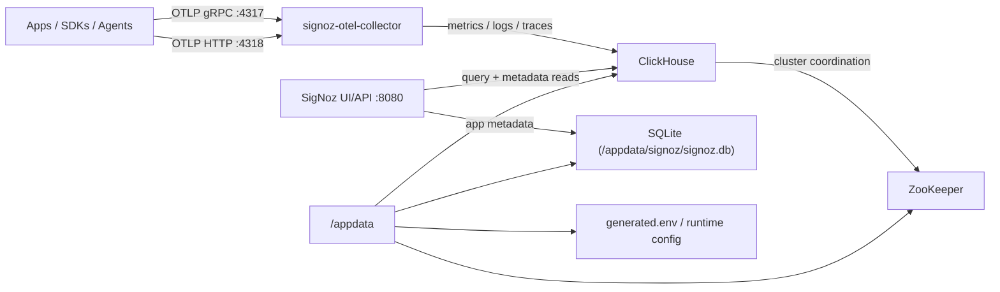
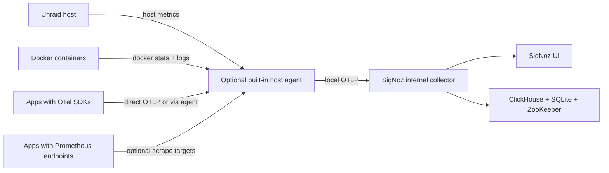

# signoz-aio - Unraid Community Application

`signoz-aio` packages the full self-hosted SigNoz stack into a single Unraid-friendly image and CA app template.

This image follows the current official SigNoz Docker deployment instead of inventing a custom rewrite. It supervises the services SigNoz currently expects for a complete small-to-medium self-hosted install:

- `signoz`
- `signoz-otel-collector`
- `clickhouse`
- `zookeeper`

## What Is Inside The Image

The image includes all of the stateful pieces needed for a self-contained SigNoz install:

- `signoz`
  - the main SigNoz UI and API service
  - stores application metadata in an internal SQLite database persisted under `/appdata/signoz`
- `signoz-otel-collector`
  - receives OTLP data on `4317` and `4318`
  - runs the telemetry-store migrations SigNoz needs in ClickHouse
- `clickhouse`
  - the primary telemetry database for traces, logs, metrics, and derived telemetry tables
- `zookeeper`
  - internal coordination layer used by the official SigNoz ClickHouse deployment

The image does not require any separate Postgres, TimescaleDB, or Redis sidecars. SigNoz's long-term telemetry data lives in ClickHouse, while SigNoz's app/config metadata in this AIO image lives in SQLite.

## Advanced Database Options

The default install is fully self-contained and uses:

- SQLite for SigNoz metadata
- bundled ClickHouse for telemetry storage
- bundled ZooKeeper for ClickHouse coordination

For power users, the advanced app settings also support:

- external PostgreSQL for SigNoz metadata
- root user provisioning through official SigNoz environment variables
- external ClickHouse endpoints for advanced deployments

Important limitation:

- PostgreSQL can replace SQLite for metadata
- PostgreSQL does not replace ClickHouse for traces, metrics, and logs
- if you move to external ClickHouse, you are moving into a more advanced deployment model and should already understand your ClickHouse and ZooKeeper topology

## Architecture

## Persistence Layout

The Unraid app intentionally keeps the mount surface simple by using one root path:

- `/appdata`

Inside that mount, the container manages:

- `/appdata/clickhouse`
- `/appdata/signoz`
- `/appdata/zookeeper`
- `/appdata/config`
- `/appdata/tmp`

## Current Status

The single-image runtime is implemented and validated.

- the image supervises `signoz`, `signoz-otel-collector`, `clickhouse`, and `zookeeper`
- `linux/amd64` build passes
- pytest-backed Docker integration testing covers:
  - first boot
  - telemetry-store migrations
  - OTLP listener readiness
  - restart and persistence
  - advanced runtime preflight paths

## First-Run Notes

- first startup is heavier than a typical single-service app because ClickHouse, ZooKeeper, SigNoz, and the collector all need to initialize
- expect more RAM and disk use than lighter AIO images
- the default setup keeps things intentionally simple:
  - one `/appdata` root
  - one UI port
  - two OTLP ingest ports
  - sane advanced defaults for the collector and internal ZooKeeper housekeeping

## Getting Data Into SigNoz

SigNoz is only useful once something is sending telemetry into it. This image gives you ready OTLP endpoints, but it does not automatically reach out and scrape your entire server by default.

The easiest ingestion paths are:

- instrument applications with OpenTelemetry and send directly to:
  - `http://YOUR-UNRAID-IP:4317` for OTLP gRPC
  - `http://YOUR-UNRAID-IP:4318` for OTLP HTTP
- run a separate OpenTelemetry Collector or Alloy agent on the Unraid host
- configure that agent to:
  - scrape Prometheus endpoints
  - collect Docker container metrics
  - tail Docker or file-based logs
  - forward everything into this `signoz-aio` container

Why keep the host agent separate?

- it avoids giving the main SigNoz container broad access to the Docker socket
- it avoids mounting host `/proc`, `/sys`, and container log directories into the main UI/database image
- it keeps the AIO install safe and beginner-friendly while still giving power users a clean upgrade path

## Recommended Monitoring Layout For Unraid

For most users, this is the sweet spot:

- `signoz-aio` stays the central backend and UI
- the optional built-in local host agent can handle host collection on the same Unraid machine
- instrumented apps can either send directly to SigNoz or rely on the local host agent for extra collection

## Releases

`signoz-aio` uses upstream-version-plus-AIO-revision releases such as `v0.120.0-aio.1`.

Every `main` build publishes `latest`, the exact pinned upstream version, an explicit packaging line tag, and `sha-<commit>`.

See [docs/releases.md](docs/releases.md) for the release workflow details.

If you want to monitor other hosts later, a separate `signoz-agent` companion app still makes sense.

## Quick Start Paths

### 1. Instrumented apps

If an app already supports OpenTelemetry, point it at:

- `OTEL_EXPORTER_OTLP_ENDPOINT=http://YOUR-UNRAID-IP:4317`
  for gRPC exporters
- `OTEL_EXPORTER_OTLP_ENDPOINT=http://YOUR-UNRAID-IP:4318`
  for HTTP exporters

Then verify in SigNoz:

- traces appear in APM / Traces
- application metrics appear in Metrics Explorer
- application logs appear in Logs if the app also exports logs

### 2. Prometheus scrape targets

If an app exposes a `/metrics` endpoint, use a host collector to scrape it and forward to SigNoz.

Starter example:

- [Prometheus scrape collector example](docs/examples/otelcol-prometheus-scrape.yaml)

### 3. Unraid host + Docker telemetry

If you want host metrics, Docker container metrics, and container logs from the same Unraid machine, enable the built-in local host agent in the app settings.

Starter example:

- [Docker / host collector example](docs/examples/otelcol-docker-host-agent.yaml)

The built-in host agent is auto-generated from the mounts and variables you provide. With the default Unraid paths, it can automatically enable:

- Unraid CPU, memory, disk, and filesystem metrics
- Docker container resource metrics
- Docker stdout/stderr logs
- optional Prometheus scrape targets you define

This is the best fit for users who want:

- one main AIO install
- minimal extra setup
- local Unraid and Docker observability without a second app

## What We Recommend Newcomers Do First

1. Get `signoz-aio` running with defaults.
2. Verify the UI loads on port `8080`.
3. Point one app or one collector at OTLP `4317` or `4318`.
4. Confirm data appears in SigNoz.
5. Only then expand into Prometheus scraping, host metrics, and container logs.

## What This AIO Does Not Bundle

This image is self-contained for the SigNoz backend stack, but observability data still has to come from somewhere. It does not automatically collect telemetry from every remote host or every service you run.

That means you still need to connect senders such as:

- OpenTelemetry SDKs inside apps
- OpenTelemetry Collector agents
- Prometheus scrape pipelines
- log shippers or agent-based host collectors

The optional built-in local host agent can collect from the same Unraid machine when you enable the advanced mounts, including the Docker socket. That is useful, but it is also a security tradeoff and it does not replace proper agents for remote systems.

## Docs And Examples

- [Ingestion guide](docs/ingestion-guide.md)
- [Configuration matrix](docs/configuration-matrix.md)
- [Docker / host collector example](docs/examples/otelcol-docker-host-agent.yaml)
- [Prometheus scrape collector example](docs/examples/otelcol-prometheus-scrape.yaml)

## Helpful References

- [SigNoz self-host Docker docs](https://signoz.io/docs/install/docker/)
- [SigNoz Docker Collection Agent overview](https://signoz.io/docs/opentelemetry-collection-agents/docker/overview/)
- [SigNoz Docker Collection Agent configuration](https://signoz.io/docs/opentelemetry-collection-agents/docker/configure/)
- [SigNoz Prometheus metrics guide](https://signoz.io/docs/userguide/prometheus-metrics)
- [SigNoz deployment README](https://github.com/SigNoz/signoz/tree/main/deploy)
- [SigNoz single-binary consolidation issue](https://github.com/SigNoz/signoz/issues/7309)

## Star History

