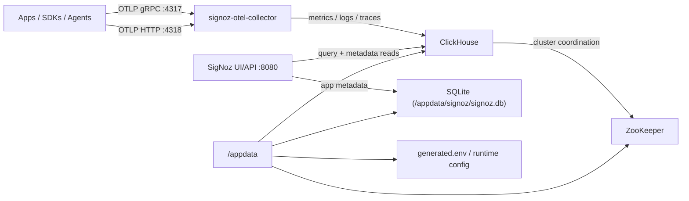

# SigNoz AIO For Unraid

`signoz-aio` packages the full self-hosted SigNoz stack into a single Unraid-friendly image and CA template.

This repo is being built around the current official SigNoz Docker deployment, not a guessed rewrite. The planned AIO image is meant to supervise the services that SigNoz currently expects for a complete small-to-medium self-hosted install:

- `signoz`
- `signoz-otel-collector`
- `clickhouse`
- `zookeeper`

## What Is Inside The Image

The current AIO image includes all of the stateful pieces needed for a self-contained SigNoz install:

- `signoz`
  - the main SigNoz UI and API service
  - stores application metadata in an internal SQLite database persisted under `/appdata/signoz`
- `signoz-otel-collector`
  - receives OTLP data on `4317` and `4318`
  - runs the telemetry-store migrations SigNoz needs in ClickHouse
- `clickhouse`
  - the primary telemetry database for traces, logs, metrics, and derived telemetry tables
- `zookeeper`
  - internal coordination layer used by the official SigNoz ClickHouse deployment

The image does not require any separate Postgres, TimescaleDB, or Redis sidecars. SigNoz's long-term telemetry data lives in ClickHouse, while SigNoz's app/config metadata in this AIO image lives in SQLite.

## Architecture

## Persistence Layout

The AIO template intentionally keeps the Unraid mount surface simple by using one root path:

- `/appdata`

Inside that mount, the container manages:

- `/appdata/clickhouse`
- `/appdata/signoz`
- `/appdata/zookeeper`
- `/appdata/config`
- `/appdata/tmp`

## Current Status

The single-image runtime is implemented and locally validated.

- the image supervises `signoz`, `signoz-otel-collector`, `clickhouse`, and `zookeeper`
- local `linux/amd64` build passes
- local smoke testing passes, including:
  - first boot
  - telemetry-store migrations
  - OTLP listener readiness
  - restart and persistence

The next step is real Unraid validation before CA submission.

## First-Run Notes

- first startup is heavier than a typical single-service app because ClickHouse, ZooKeeper, SigNoz, and the collector all need to initialize
- expect more RAM and disk use than lighter AIO images
- the default AIO template keeps setup intentionally simple:
  - one `/appdata` root
  - one UI port
  - two OTLP ingest ports
  - sane advanced defaults for the collector and internal ZooKeeper housekeeping

## What This AIO Does Not Bundle

This image is self-contained for the SigNoz core stack, but observability data still has to come from somewhere. It does not automatically collect telemetry from your entire Unraid host or every Docker container on your server by default.

That means you still need to connect senders such as:

- OpenTelemetry SDKs inside apps
- OpenTelemetry Collector agents
- Prometheus scrape pipelines
- log shippers or agent-based host collectors

## Upstream Snapshot

Based on the official `SigNoz/signoz` Docker deployment checked on March 29, 2026, the upstream stack currently pins:

- `signoz/signoz:v0.117.1`
- `signoz/signoz-otel-collector:v0.144.2`
- `clickhouse/clickhouse-server:25.5.6`
- `signoz/zookeeper:3.7.1`

The official Docker deployment exposes:

- `8080` for the SigNoz UI and API
- `4317` for OTLP gRPC ingest
- `4318` for OTLP HTTP ingest

## Unraid AIO Shape

The current `signoz-aio` contract is:

- one custom image
- one primary appdata root, likely `/appdata`
- persisted internal data for:
  - ClickHouse
  - ZooKeeper
  - SigNoz SQLite/config state
- exposed ports for:
  - `8080`
  - `4317`
  - `4318`
- local smoke tests that verify:
  - bootstrap
  - service readiness
  - OTLP listener availability
  - persistence across restart
  - health endpoint response

## Important Design Constraints

- this should mirror official SigNoz behavior closely enough to remain maintainable
- it should be honest about embedded services and storage cost
- it should prefer stable upstream versions and PR-first updates
- it should be beginner-safe for Unraid without hiding important observability tradeoffs
- it should expose only real upstream-backed advanced settings instead of speculative knobs

## Key Docs

- [Implementation plan](/tmp/signoz-aio/docs/implementation-plan.md)
- [Upstream tracking notes](/tmp/signoz-aio/docs/upstream-tracking.md)
- [Release checklist](/tmp/signoz-aio/docs/release-checklist.md)

## Sources Used For Bootstrap

- [SigNoz self-host Docker docs](https://signoz.io/docs/install/docker/)
- [SigNoz deployment README](https://github.com/SigNoz/signoz/tree/main/deploy)
- [SigNoz single-binary consolidation issue](https://github.com/SigNoz/signoz/issues/7309)

## Star History

